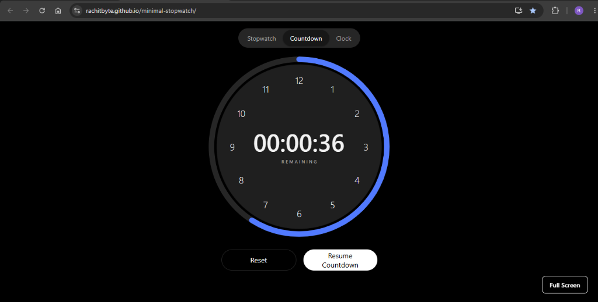
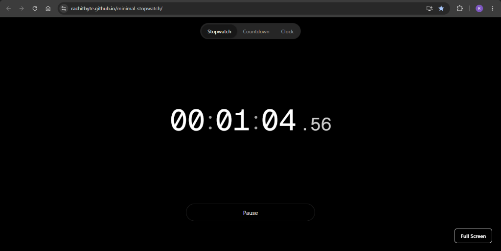
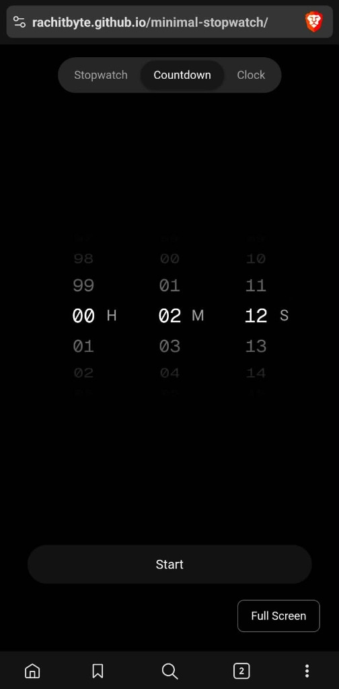

# Tempo

### Time, without distractions.

Tempo is a minimalist time tool created for studying, working, and focused sessions.

It started from a simple need: a clean and aesthetic screen that shows a stopwatch or countdown in fullscreen without unnecessary UI or distractions.

## Screenshots

  
    
  
    
  

## Features

Tempo intentionally has only three modes:

- **Stopwatch** — measure how long you have been working.
- **Countdown** — set a duration and see how much time remains.
- **Clock** — view the current time.

### Stopwatch
- Start
- Pause
- Reset
- No laps or split times

### Countdown
- Simple `HH : MM : SS` duration picker
- Starts at `00 : 00 : 00`
- Picker only changes through user interaction
- Analog-style clock visualization
- Smooth circular progress ring
- Dynamic electric-spectrum colors
- Completion animation

### Clock
- Simple, distraction-free clock display

### Fullscreen
All three modes support fullscreen where the browser allows it.

Fullscreen is designed to make Tempo useful as a distraction-free screen while studying or working.

## Design Philosophy

Tempo follows three principles:

- **Minimal** — show only what is necessary.
- **Simple** — easy to understand and use.
- **Distraction-free** — the tool should stay out of the way.

Tempo deliberately avoids unnecessary features such as multiple timers, laps, accounts, dashboards, social features, and excessive customization.

## State

Tempo does **not** persist timer state.

Refreshing the page starts a new session.

## Keyboard Shortcuts

| Key | Action |
|---|---|
| `Space` | Start / Pause |
| `R` | Reset |
| `F` | Fullscreen |
| `Esc` | Exit Fullscreen |

## Technology

- TypeScript
- Vite
- Vanilla CSS
- SVG
- Browser APIs

## Project Goal

Tempo is built for one simple purpose:

> **Know how long you have been working or how much time you have left — without the tool itself becoming a distraction.**

**Tempo — Time, without distractions.**